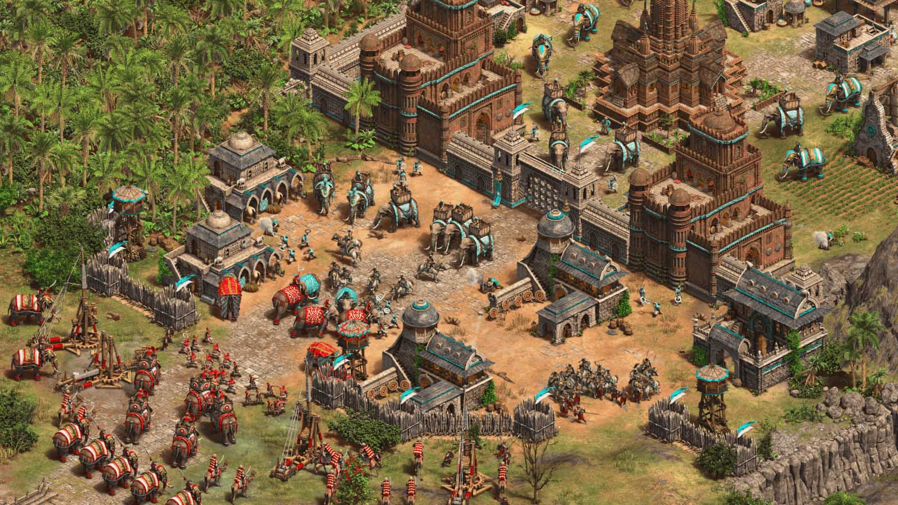
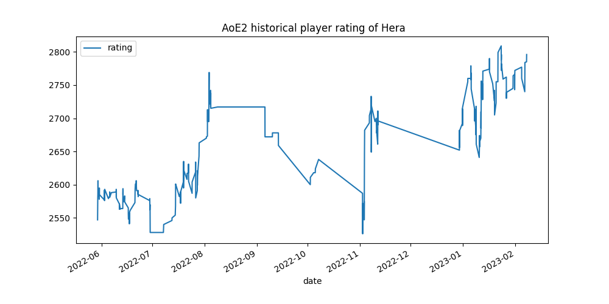
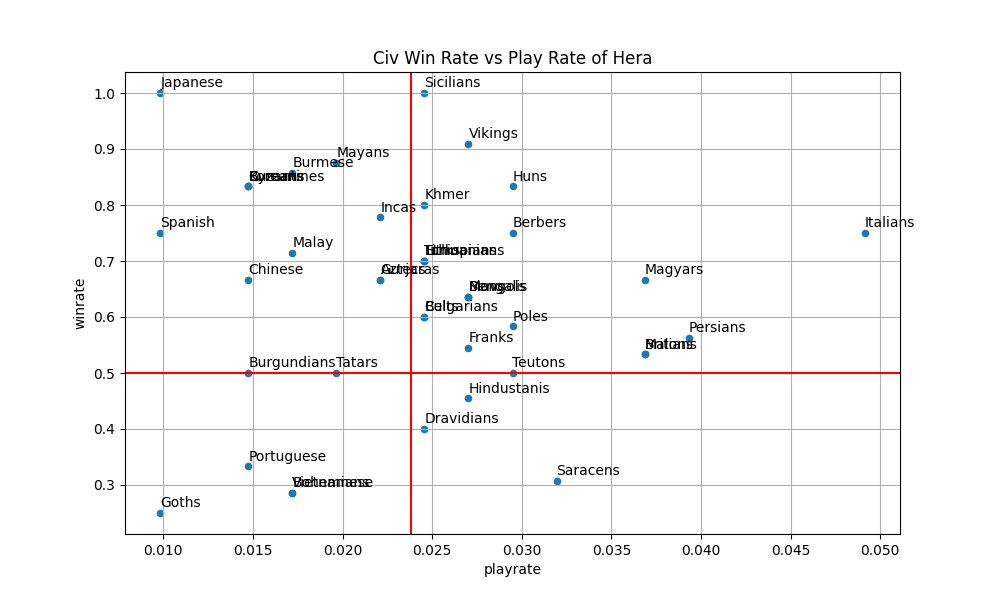
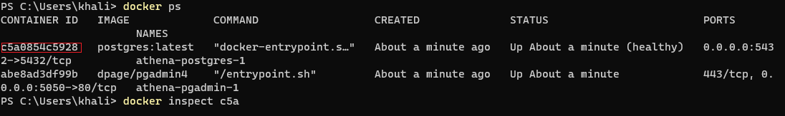
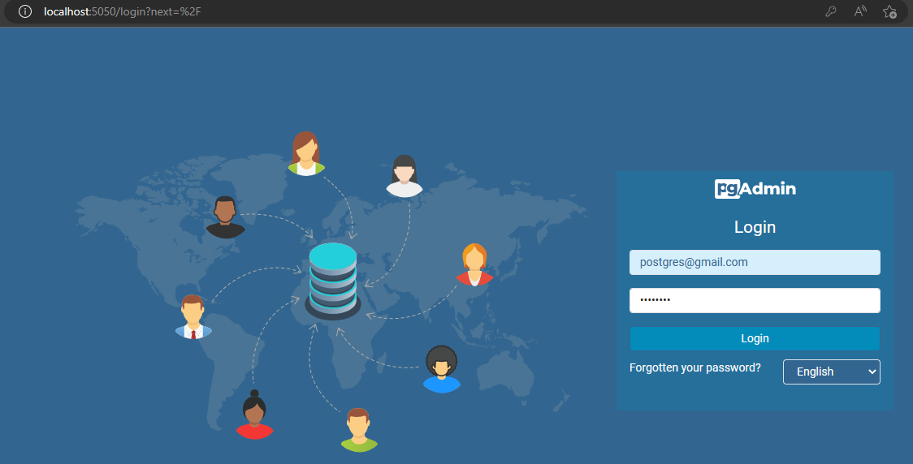
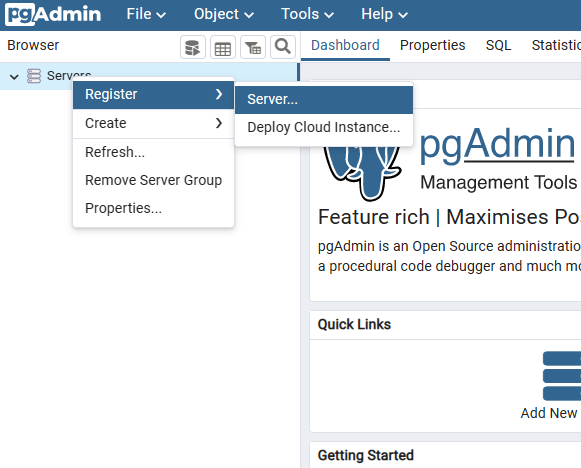
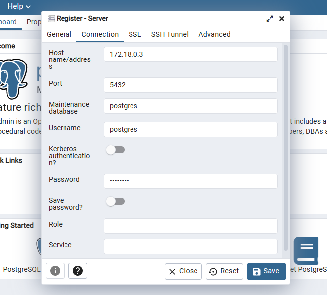

## Introduction

Age of Empires 2 is an iconic real-time strategy game that has been around for more than 20 years. The game is set in the Middle Ages and players must build a powerful empire from scratch by gathering resources, researching technology, and building armies. The game is highly balanced and has withstood the test of time. Players compete against each other and must learn to balance the economic, military and technological aspects of their empires in order to succeed. With its diverse civilisations offering each unique bonuses, expansive maps, and deep strategic depth, Age of Empires 2 has become one of the most popular and beloved strategy games of all time. 

In this project we will be analysing top players performance and how it varies across different civilisations. This could help the development team making the game more balanced or can help us become better players ourselves by knowing the best strategies.





## Data sources

We will be using [aoe2.net API](https://aoe2.net/#api) which is an Unofficial API to query data of the game.

We will use it to gather the top 100 players informations in ranked 1vs1 matches (leaderboard) like profile_id, rank, name, country and other stats about their performances.

We will also use The API to collect historical 1vs1 ranked matches data of the top players in the game like match_id, map_type, informations about players and their choices like their name, profile_id, picked civ and color and their rating change and other informations about the game.

The API allows a maximum of 100 lines per requests. So we would have to execute it many times to get enough data. Some fields have missing values and we might have to deduce their true value and replace them.

Some informations about the games like picked civilisations and map types are abbreviated and are represented by integers. We will be using dictionnaries to convert them to their corresponding name. For that, we used the API to get the maps and civs ids and their corresponding value and placed them into files in the cloud as google speadsheets files after some adjustement because some values were outdated. We will be using these files [civs file](https://docs.google.com/spreadsheets/d/1z25PgHskf6AE6mbwKQahoQrcd9SpOo26U-2ZiUI0SMk/edit?usp=sharing) and [map_type file](https://docs.google.com/spreadsheets/d/1QG1MWrOwEp1DRT4uHyjWwoEcdvuKON87yqIpToNUyJU/edit?usp=sharing) as dictionnaries to replace the abbreviated values.

## Technologies

This project is mainly implemented with ***python***. We used packages like ***requests*** to extract data from API, ***pandas*** to manipulate and transform data, ***pandera*** to check and validate their quality and ***SQLalchemy*** to connect to database and execute ***SQL*** requests. We also used the ***Matploblib*** functions integreted in the ***pandas*** package to generate some visualisations.

For our database we used ***postgreSQL*** and we used ***pgAdmin*** to check database status.

Finally, we used ***docker*** to create different containers for each of our ***python*** scripts and for ***postgreSQL*** and ***pgAdmin***.

## Architecture

We have implemented 3 python scripts each to be executed seperately in different containers in a specific order.

After loading the SQL database container and checking if the database is ready to accept connections. We start executing the first script **leaderboard.py** that retrieves the top players data from the API, drop and transform some columns, check their quality and create or replace the table *leaderboard* in the database.

After **leaderboard.py** is finished, the second script **matches.py** is executed. The script extract the two files stored in the cloud: [civs file](https://docs.google.com/spreadsheets/d/1z25PgHskf6AE6mbwKQahoQrcd9SpOo26U-2ZiUI0SMk/edit?usp=sharing) and [map_type file](https://docs.google.com/spreadsheets/d/1QG1MWrOwEp1DRT4uHyjWwoEcdvuKON87yqIpToNUyJU/edit?usp=sharing) as dictionnaries to replace the abbreviated values and execute many iterations to retrieve the data of 100 historical matches of a specific player from the API using his profile_id (in this case we loaded the data of historical matches of the top 1 player Hera), filter the data of 1vs1 ranked matches, drop and transform some columns and upsert (update and insert) the data into the table *matches* in the database during each iteration. The script will create the table *matches* if it doesn't already exist.

Finally, after **matches.py** is finished, the third script **analyse.py** is executed. The script connect to the database and execute an ***SQL*** request to create a view to join the data of the two tables *leaderboard* and *matches*, print the first 5 rows and then get the data of a specific player, apply some transformations and calculations and generate two graphs one for the evolution of player's rating and one comparing their playrate and winrate with each civ.

## Data Transformation

During the previous section we have explained the architecture and how each script work. In this section we will explain some data transformations we had to do in each script.

### leaderboard

For this table we had to convert the column ***last_match_time*** from Unix epoch time to human readable datetime format.

### matches

For this table we had to convert the columns ***started*** and ***finished*** from Unix epoch time to human readable datetime format.

We also had to convert abbreviated values of columns ***civ*** and ***map_type*** by using dictionnaries we created by extracting the two files  [civs file](https://docs.google.com/spreadsheets/d/1z25PgHskf6AE6mbwKQahoQrcd9SpOo26U-2ZiUI0SMk/edit?usp=sharing) and [map_type file](https://docs.google.com/spreadsheets/d/1QG1MWrOwEp1DRT4uHyjWwoEcdvuKON87yqIpToNUyJU/edit?usp=sharing)

The columns ***rating_change*** and ***rating*** are related and had some missing values and we replaced some of the missing values based on the previous values to improve data quality.

Finally, we created a new column ***won*** to indicate the outcome of the game and we deduced the outcome of the match based on the sign of ***rating_change***.

### analyse.py

Despite replacing many missing value of the column ***rating*** the column still had missing values we couldn't complete. So in order to create a visualisation of the historical evolution of player's rating. We had to replace them with the values of the previous rows.

## Visualisation


Here we have generated the historical player rating of the top1 player in the game.


This graphe allows us to analyse the strategies often used by the player comparing his winrate and playrate with each civ:



The redlines indicate the average playrate and winrate across all civs.

If we notice the same pattern with other players in the leaderboard we can deduce that playing with civs like *Goths* and *Portuguese* are not good in high rating matches and perhaps need more balance changes by the devs to make them compete with other civs in the game.

## Checking database status

In order to check database status. We have added a container for ***pgadmin*** a platform that we will use to connect to our database and check its status.

After launching the container. We will use a second terminal and execute the following command to get Container ID of the database container.

```docker ps ```



We then execute: ``` docker inspect [postgres container ID]``` and retrieve the IPAddress.


Now we use our browser and go to ```localhost:5050 ``` and we connect by setting email and password:

- email: **postgres@gmail.com**
- password: **postgres**



After that we register our postgres server like the following screenshot:



we set a name for the server and we set address to the IPaddress we retrieved previously from inspecting the postgres container ID. and we set Port to **5432** and username and password to **postgres**.



Now that we have connected to our postgres database we can check its status using pgAdmin.

## Possible improvements

Data quality can be further improved because there're many missing values that can be found in other sources or even in other fields in the same table. There's also more checks and controls to be implemented to ensure data quality.

The graphs we generated can be improved to be more clearer and easier on the eyes.

In this exemple we retrieved the historical matches for one player. It will be more intresting to retrieve more matches for different players present in the leaderboard and analyse different strategies and their playrate and winrate with different civilisations in different maps.

The structure of this report can be also improved to include more details.

## Challenges encountred

While working on this project, we had encountered many challenges. The current API we're using is an unofficial source and sometimes the service is unstable and can go offline. 

Some values like civs IDs were outdated and we had to correct them by checking other sources and by using our knowledge of the game. 

We also had difficulties to make the first script wait for the postgres container until it's ready to receive connection but that issue had been solved after adding a healthcheck command in the docker-compose file.
